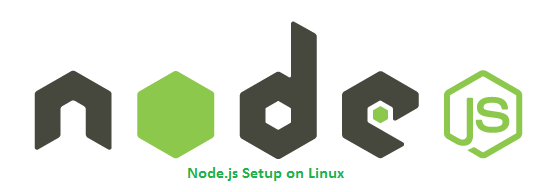
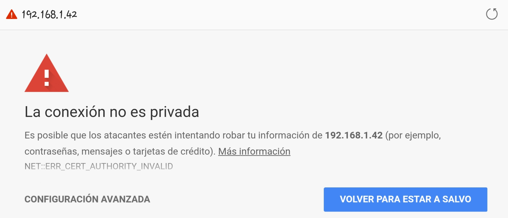
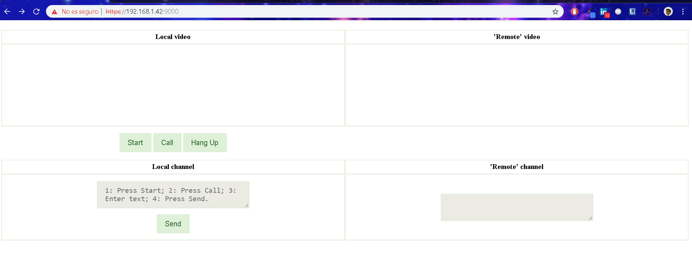

# servidor-web-apache-nodejs-expres

# Introducció

Es construirà una aplicació de videoconferència, basada en el navegador, fent servir **WebRTC** on es disposarà de:
- dos requadres de vídeo:
    - a "**Local video**" es mostrarà el vídeo de la càmera web local
    - a "**Remote video**" es mostrarà el vídeo de la càmera web remota
- dos requadres de xat:
    - "**Local channel**"
    - "**Remote channel**"

Cal que cada part envia el vídeo/àudio/xat a l'altra part directament. WebRTC disposa de diverses APIs en JS
- **getUserMedia (o MediaStream):** permet al navegador accedir p.e., a la càmera i al micròfon, i obtenir-ne fluxos (*streams*).
- **RTCPeerConnection:** permet establir trucades d'àudio i vídeo, enviar els fluxos, etc., entre navegadors.
- **RTCDataChannel:** permet enviar dades entre navegadors.
- **getStats:** permet obtenir estadístiques sobre l'enviament dels fluxos (p.e., paquets perduts, retard, etc.).

*WebRTC* no està implementat en tots els navegadors, ni tampoc exactament igual. En aquesta pràctica es farà servir el navegador Chrome. *WebRTC* requereix un servidor web segur (cal veure com es fa amb *Apache*, *Node.JS* o altres).

## Entorn de treball
Per fer un servidor web segur cal disposar d'un **certifcat SSL**[1]. Tenim diferents opcions per
disposar d'un certifcat SSL. En aquest cas, utilitzarem els **certifcats autosignats**[2].
El servidor web segur de l'HTML+JS de WebRTC es farà amb Node.JS+Express (també es podria fer amb Apache, etc.).
A part del servidor web segur, caldrà tenir un **servidor de senyalització**[3] (el servidor de senyalització es realitzarà amb Node.JS + socket.io).

[1] Certifcat emès per un centre de confança o autoritat certifcadora (CA)
[2] Permeten encriptar però no són de confança (el navegador ho dirà); adequats per fer desenvolupament utilitzarem.
[3] En una aplicació WebRTC el canal de senyalització és necessari per permetre l'intercanvi de descriptors de sessió (SDP). El servidor de senyalització crea el canal i intercanvia els missatges necessaris per establir la connexió entre parells.

## Instal·lació Certicat SSL

En aquest apartat s'explicarà com configurar un certificat SSL amb Node.js a Linux. Per fer-ho, només caldran tres passos.

### Pas 1: Crea *Self Signed SSL*

Per a les aplicacions de producció, s'ha de comprar una SSL verificada per les autoritats certificades. En aquest cas, s'està utilitzant un ***Self Signed SSL*** que és suficient per a aplicacions de desenvolupament.

En primer lloc, s'ha de crear una CSR per a aquest domini. S'ha de proporcionar els valors desitjats a les preguntes que es demanen.

~~~
//Ens posicionem a la carpeta del projecte
//Creem una nova carpeta pels certificats
sudo mkdir cert

//Accedim a la carpeta creada
cd certs

//Creem el CSR del domini practica3.com
openssl req -new -newkey rsa:2048 -nodes -keyout practica3.com.key -out practica3.com.csr
~~~

Ara teniu una CSR que podeu utilitzar per obtenir el certificat SSL de les autoritats SSL verificades. A més, podeu crear certificats ***Self Signed SSL*** per als llocs de desenvolupament mitjançant el següent comandament.

~~~
//Creem el CSR del domini practica3.com
openssl x509 -req -days 365 -in example.com.csr -signkey practica3.com.key -out practica3.com.crt
~~~

### Pas 2: Crea un servidor HTTPS de Node.js

Per aquest apartat, es crearà el servidor HTTPS utilitzant Node.js. Anem al fitxer **signalingandwebserver.js** que contindrà el servidor web següent:

~~~
//Creem el CSR del domini practica3.com
openssl req -new -newkey rsa:2048 -nodes -keyout practica3.com.key -out practica3.com.csr

//Creem el CSR del domini practica3.com
openssl x509 -req -days 365 -in example.com.csr -signkey practica3.com.key -out practica3.com.crt

//Engeguem el servidor
node signalingandwebserver.js
~~~

### Pas 3: Inici i accés a l'aplicació Node.js

Ara només cal utilitizar l'ordre següent per iniciar l'aplicació Node.js creada.

~~~
//Engeguem el servidor
node signalingandwebserver.js
~~~

Aquesta aplicació serà accessible només amb HTTPS url. Connecteu el vostre servidor al port 9000 amb el protocol HTTPS.

Obtindreu una pantalla superior mentre feu servir el certificat SSL autofirmat. Només cal que feu clic a procedir de qualsevol manera.

## Estructura del projecte  

L’aplicació de videoconferència que està mig fet, es completerà el codi, de manera que hi haurà:
	- un fitxer **package.json** que descriu el projecte.
	- una fitxer **index.html** que descriu la interfície web senzilla per reproduir l'àudio/video i el xat.
	- una fitxer **localPeerConnection-lib.js** que correspon a una llibrería de variables globals i funcions.
	- un fitxer **localPeerConnection.js** que realitza la inicialització de l'aplicació de la videoconferència i les accions necessàries, incloent la senyalització.
	- un fitxer **signalingwebserver.js** que és alhora un servidor web segur que serveix l’***HTML***+***JS*** de l'aplicació i el servidor de senyalització.
